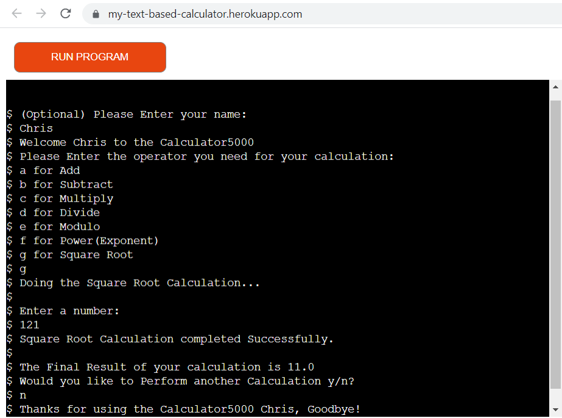
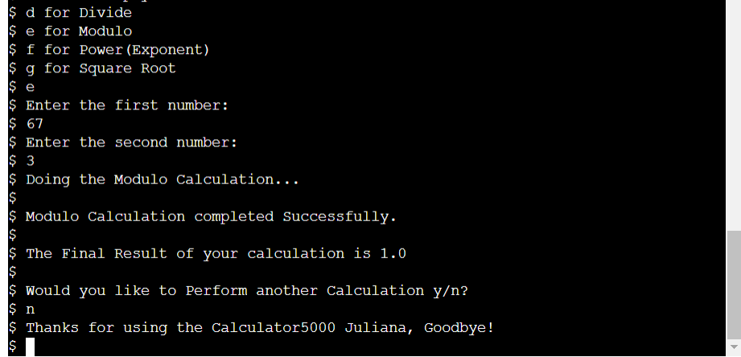

# Text-based Calculator

This is a calculator project that was created using Python Programming language. It is a very basic calculator with simple functionalities which allows a user to input a number or 2 numbers based on the operation to be performed and the code carries out the operation and returns the appropriate result. Interaction with the calculator is restricted to the terminal as Python is a back-end language so there is no GUI available to the user. They simply follow the text-based instructions displayed at the terminal aand if the instructions are followed correctly, they will get their desired result printed to the terminal.

# Features

The calculator provides the basic function of a simple calculator which can be used by any one for their everyday mathematical operations.

# Existing Features

The features provided by the calculator are as follows:

* choice 'a' for Add ('+') operator to add two numbers 
* choice 'b' for Subtract ('-') operator to subtract two numbers
* choice 'c' for Multiply ('*') operator to multiply two numbers 
* choice 'd' for Divide ('/') operator to divide two numbers
* choice 'e' for Modulo ('%') operator to get the remainder of two  numbers after division
* choice 'f' for Power/Exponent ('**') operator to get the exponent of two numbers 
* choice 'g' for Square Root ('√') operator to get the square root of a number.

---

User Experience (UX)

* User stories

    * User Goals

        a) I want to be able to add two numbers together and get the right result.

        b) I want to be able to subtract two numbers and get the right result.
    
        c) I want to be able to multiply two numbers and get the right result. 

        d) I want to be able to divide two numbers and get the right result. 

        e) I want to be able to calculate the modulo (remainder after dividing two numbers) and get the right result. 
        
        f) I want to be able to calculate the exponent (power) of two numbers and get the right result.
        
        g) I want to be able to calculate the square root of a number and get the right result. 

        h) I want to be able to get feedback if wrong operand (number) is entered as input.

        i) I want to be able to get feedback if wrong operator is entered as input.
        
        j) I want to be able to continue using the calculator without running the app afresh and quit whenever I like.
        
# Flowchart

The flowchart was used to conceptualise/bring the text-based calculator idea to life. It was drawn manually using pencil and paper to depict how the flow of the program will go.

* View the flowchart below: 

# Technologies Used

* Language Used

    * Python

---

* Tools Used

    * The Flowchart was made manually using paper and pencil.

    * snipping tool to capture screenshots of pep8 validator result, result generated at terminal and images used in the README file.

* Issues Encountered and Resolved

    * When a user finishes an operation, I want the code to ask the user if he wants to perform any more calculation and if 'y' is chosen by the user, the program should present the user with the option to choose the operator and the operands needed again and perform the required calculation for as long as the user wants and to quit when the user chooses 'n'  but when I ran my code it was not performing as such. I knew I would need a while loop but where to place that in the code was tricky but after many failed attempts, I figured that the while loop should be added to the user's response of 'yes or no'. If Yes is chosen,it continues to loop and if No, it exits the calculator. I also called the calculate_operation() function within the while loop. See screenshot below:

    

    * Initially, the "choice" variable for the input operator was made as a standalone code and when the program is called to run again when a user chooses 'yes', the 'choice' variable could not be called which made it impossible for a user to choose their operator so I decided to wrap it into a function named choose_operator() and when the calculate_operation() is called, the choose_operator() function will be called first within it, and this approach worked. 

    * When the code was run in Gitpod workspace, every part worked perfectly well but on the deployed site, Heroku, it performed the required operation and displayed the final result but didn't display the loop question/message that says "Do you want to perform another calculation y/n?. On pressing the enter key, it then displays the question together with the goodbye message signalling the end without allowing the user to pick an option of 'y' or 'no'. After searching for resources online and trying several things, I found out that the solution to the issue was already explained in the deployment section of the love-sandwiches video, not adding a new line character ("\n") at the end of the question caused the error. See screenshot below:

    .

Frameworks, Libraries and Programs Used

1. Git

    * Git was used for version control by utilising the Gitpod terminal to commit to Git and push to GitHub.

2. GitHub

    * GitHub was used to store the project's code after being pushed from Git.

I am aware that the requirements.txt file is empty since I didn't need it for my project but I have left it in because I know it's needed for the Heroku to run

## Testing

PEP8 online validation tool was used to validate the code to ensure there were no syntax errors or improper code indentation. It passed the test as seen in the screenshot below:

### Testing User Stories from User Experience (UX) Section

i. I want to be able to add two numbers together and get the right result.

    a. User inputs two numbers, the app performs the addition operation and produces the correct result as seen in the screenshots below:

ii. I want to be able to subtract two numbers and get the right result.

    a. User inputs two numbers, the app performs the subtraction operation and produces the correct result as seen in the screenshots below: 

iii. I want to be able to multiply two numbers and get the right result.

    a.  User inputs two numbers, the app performs the multiplication operation and produces the correct result as seen in the screenshots below: 

 

iv. I want to be able to divide two numbers and get the right result.

    a. User inputs two numbers, the app performs the division operation and produces the correct result as seen in the screenshots below:

 

v. I want to be able to calculate the modulo (remainder after dividing two numbers) and get the right result.

    a. User inputs two numbers, the app performs the modulo operation and produces the correct result as seen in the screenshots below:

vi. I want to be able to calculate the exponent (power) of two numbers and get the right result.

    a. User inputs two numbers, the app performs the exponent operation and produces the correct result as seen in the screenshots below:

 

vii. I want to be able to calculate the square root of a number and get the right result. 

    a. User inputs one number only, the app performs the square root operation and produces the correct result as seen in the screenshot below: 

viii. I want to be able to get feedback if wrong operand (number) is entered as input.

    a. User inputs incorrect operand, the app displays the message "Invalid input - NOT a number, Please try again!" to the screen and gives them the opportunity to re-choose a valid operand. See screenshots below: 

ix. I want to be able to get feedback if wrong operator is entered as input.

    a. User inputs incorrect choice of operator, the app proceeds to ask the user to input the 2 numbers, then it displays the error message "The Final Result of your calculation is Null. You entered an invalid operator" and asks the user if he wants to perform another Calculation as seen in the screenshot below:

x. I want to be able to continue using the calculator without running the app afresh and quit whenever I like.

    a. Once the app displays the result of the current calculation, it asks the user if he wants to perform another calculation. If 'y' or 'Y' is chosen, the app continues by asking the user to choose the operator needed and the whole process is repeated again for as many times as the user wants but if 'n' or 'N' is chosen, the calculator app displays goodbye message to the user and quits as seen in the screenshots below:

 

---

# Deployment

* The Project was deployed to Heroku using the following steps:

  1. Firstly, in order for the input method to work correctly in the deployed platform Heroku, you need to add a new line character at the end of the text and save it or else the text will not show up in the terminal. 

  2. Next, you will create a list of requirements that the project needs in order to run.  Since we installed several dependencies such as gspread and google-auth into the workspace when we set it up initially, you need Heroku  

        

I am aware that the requirements.txt file has no content in it but I left it in because it is required  in order for heroku to run perfectly.